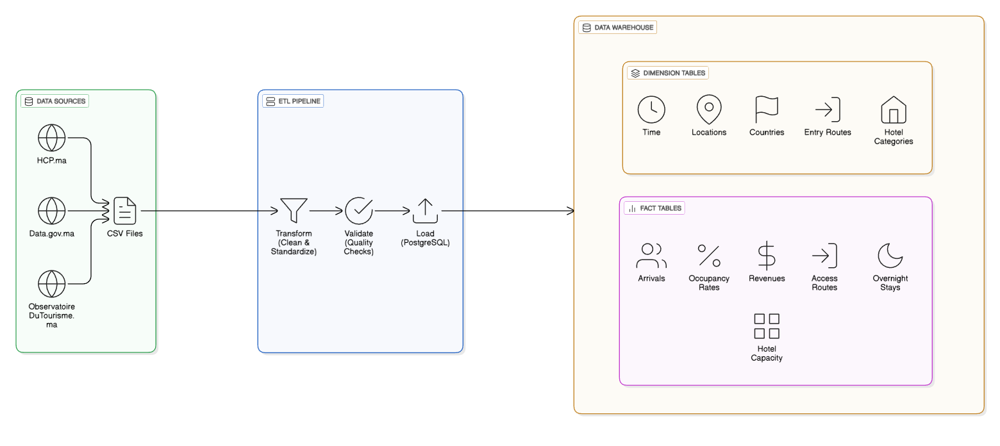

# Morocco Tourism ETL Pipeline


> ETL pipeline for Morocco's tourism data warehouse. Collects data from HCP.ma, Data.gov.ma, and ObservatoireDuTourisme.ma.

**Version:** 1.0.0 | **Python:** 3.8+ | **PostgreSQL:** 12+

## 🚀 Quick Start
```bash
# Setup environment
python -m venv venv
source venv/bin/activate  # Linux/macOS: venv\Scripts\activate (Windows)
pip install -r requirements.txt

# Create database
psql -U postgres -c "CREATE DATABASE morocco_tourism;"
psql -U postgres -d morocco_tourism -f sql/schema.sql

# Configure connection in config/config.json
# Add CSV files to data/raw/
# Run pipeline
python scripts/main.py
```

## 📁 Project Structure
```
morocco-tourism-etl/
├── data/
│   ├── raw/              # Source CSV files
│   ├── processed/        # Cleaned data
│   └── logs/             # Logs & reports
├── scripts/
│   ├── main.py          # Pipeline orchestrator
│   ├── transform.py     # Data transformation
│   ├── validate.py      # Quality validation
│   └── load.py          # Database loader
├── sql/
│   └── schema.sql       # Database schema
└── config/
    └── config.json      # Configuration
```

## 🗂️ Data Warehouse Schema

### Star Schema Architecture
```
                    ┌─────────────────┐
                    │   dim_temps     │
                    │  (Time)         │
                    └────────┬────────┘
                             │
        ┌────────────────────┼────────────────────┐
        │                    │                    │
        v                    v                    v
┌──────────────┐      ┌──────────────┐      ┌──────────────┐
│fact_arrivees │      │ fact_nuitees │      │fact_recettes │
│(Arrivals)    │      │(Stays)       │      │(Revenues)    │
└──────┬───────┘      └──────┬───────┘      └──────────────┘
       │                     │
       v                     v
┌──────────────────┐  ┌──────────────────┐
│dim_nationalites  │  │dim_destinations  │
│(Countries)       │  │(Locations)       │
└──────────────────┘  └──────────────────┘
       │
       v
┌──────────────────┐
│dim_categories_   │
│hotel (Categories)│
└──────────────────┘
```

### Dimension Tables

| Table | Description | Key Columns |
|-------|-------------|-------------|
| `dim_temps` | Time dimension | `id_temps`, `annee`, `mois` |
| `dim_destinations` | Tourist destinations | `id_destination`, `nom_destination` |
| `dim_nationalites` | Source countries | `id_nationalite`, `nom_nationalite` |
| `dim_categories_hotel` | Hotel ratings (1-5 stars) | `id_categorie`, `nom_categorie` |
| `dim_voies_acces` | Entry routes | `id_voie`, `nom_voie` |

### Fact Tables

| Table | Description | Key Metrics |
|-------|-------------|-------------|
| `fact_arrivees` | Tourist arrivals | `arrivees` (number of arrivals) |
| `fact_nuitees` | Overnight stays | `nuitees` (number of nights) |
| `fact_recettes` | Monthly revenues | `recettes` (revenue in MAD) |
| `fact_capacite_hoteliere` | Hotel capacity | `nombre_etablissements`, `capacite_lits` |
| `fact_taux_occupation` | Occupancy rates | `taux_occupation` (%) |
| `fact_voies_acces` | Access routes | `nombre_entrees` (entries count) |

## 📊 Source Data Files

Place these CSV files in `data/raw/`:

| File | Description | Columns |
|------|-------------|---------|
| `01_arrivees_type.csv` | Arrivals by tourist type | Type, Years (2012-2024) |
| `02_arrivees_nationalite.csv` | Arrivals by nationality | Nationality, Years |
| `03_nuitees_destination.csv` | Stays by destination | Destination, Nationality, Years |
| `04_nuitees_nationalite.csv` | Stays by nationality | Nationality, Years |
| `05_recettes_mensuelles.csv` | Monthly revenues | Month, Years |
| `06_capacite_hoteliere.csv` | Hotel capacity | Category, Years |
| `07_taux_occupation.csv` | Occupancy rates | Destination, Years |
| `08_arrivees_mensuelles.csv` | Monthly arrivals | Month, Years |
| `09_nuitees_mensuelles.csv` | Monthly stays | Month, Years |
| `10_voies_acces.csv` | Entry routes | Route, Years |
| `11_indicateurs_globaux.csv` | Global indicators | Indicator, Years |
| `12_top_destinations.csv` | Top destinations | Destination, Years |

## 📈 Pipeline Phases

1. **TRANSFORM**: Clean, normalize, and standardize data
2. **VALIDATE**: Quality checks and validation reports
3. **LOAD**: Populate data warehouse tables

**Total execution time:** ~7 seconds

## 🌐 Data Sources

- **[HCP.ma](https://www.hcp.ma)** - Haut-Commissariat au Plan
- **[Data.gov.ma](https://www.data.gov.ma)** - Morocco Open Data Portal
- **[ObservatoireDuTourisme.ma](https://www.observatoiredutourisme.ma)** - Tourism Observatory

## 📋 Configuration

Edit `config/config.json`:
```json
{
  "database": {
    "host": "localhost",
    "port": 5432,
    "database": "morocco_tourism",
    "user": "postgres",
    "password": "your_password"
  },
  "paths": {
    "raw_data": "data/raw/",
    "processed_data": "data/processed/"
  },
  "etl": {
    "batch_size": 1000,
    "max_retries": 3
  }
}
```

## 📄 License

MIT License
